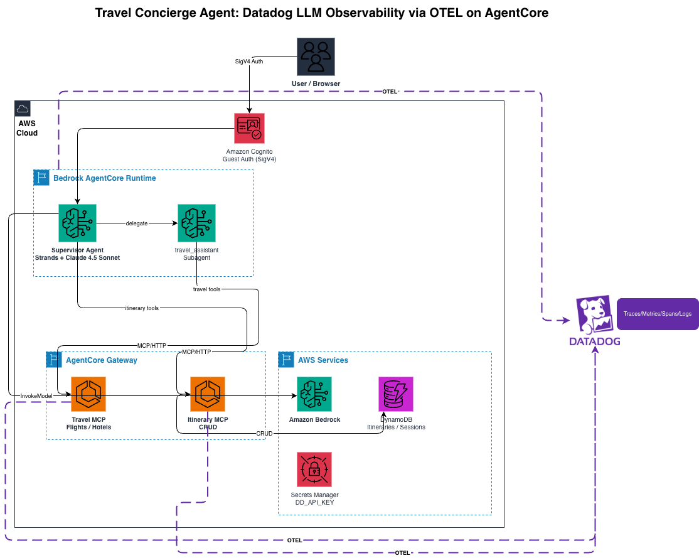

# Datadog LLM Observability for Amazon Bedrock AgentCore Travel Concierge Agent

End-to-end observability for a multi-agent AI travel concierge, powered by [Datadog LLM Observability](https://docs.datadoghq.com/llm_observability/) and [Amazon Bedrock AgentCore](https://docs.aws.amazon.com/bedrock/latest/userguide/agentcore.html).

> **Note:** This sample is forked from the upstream [travel-concierge-agent](https://github.com/awslabs/amazon-bedrock-agentcore-samples/tree/main/05-blueprints/travel-concierge-agent) blueprint and adds Datadog observability using a pure OpenTelemetry approach — no Datadog Agent or `ddtrace` required.

## What This Sample Demonstrates

- **Pure OTEL LLM Observability** — Strands Agents emits [OpenTelemetry-compliant spans](https://www.datadoghq.com/blog/llm-aws-strands/) (GenAI semantic conventions) via `strands-agents[otel]`; a custom `TracerProvider` with `OTLPSpanExporter` sends them directly to [Datadog LLM Observability](https://docs.datadoghq.com/llm_observability/instrumentation/otel_instrumentation/)
- **AgentCore Integration** — Uses AgentCore's documented approach for [third-party observability platforms](https://docs.aws.amazon.com/bedrock-agentcore/latest/devguide/observability-configure.html): `DISABLE_ADOT_OBSERVABILITY=true` disables the built-in ADOT/CloudWatch pipeline so Datadog is the sole observability backend
- **No Datadog Agent Required** — All traces are exported directly to Datadog's OTLP intake endpoint over HTTPS using `dd-otlp-source=llmobs` headers, which routes them to [Datadog LLM Observability](https://docs.datadoghq.com/llm_observability/) views
- **GenAI Semantic Conventions** — `OTEL_SEMCONV_STABILITY_OPT_IN=gen_ai_latest_experimental` enables OpenTelemetry v1.37+ GenAI semantic conventions for LLM-specific trace views (prompts, completions, token usage, latency)
- **Troubleshooting Workflows** — Three documented scenarios showing how to debug slow tool calls, high token usage, and agent errors using Datadog's trace waterfall and LLM Observability views

## Architecture



From the user's perspective, the system works as follows:

1. The user opens the React Web UI (served locally or via Amplify hosting) and types a travel request, such as "Find flights from NYC to Tokyo" or "Build me a 5-day itinerary for Paris"
2. The Web UI authenticates using Cognito Identity Pool guest credentials and sends the request to AgentCore Runtime via SigV4-signed HTTPS
3. The Supervisor Agent (a Strands Agent powered by Claude Sonnet 4.5) receives the request and decides how to handle it. For travel queries, it delegates to the `travel_assistant` subagent; for itinerary management, it invokes itinerary tools directly
4. The subagent or supervisor calls MCP tools through the AgentCore Gateway, which routes requests to the appropriate MCP server (Travel or Itinerary), each running as a containerized service in AgentCore Runtime
5. The Travel MCP Server searches for flights, hotels, and activities via external APIs, while the Itinerary MCP Server manages user profiles and saved itineraries in DynamoDB
6. Results flow back through the chain to the Web UI, where the user sees formatted travel options, itinerary suggestions, or booking confirmations
7. Every step of this flow (LLM calls, tool invocations, subagent delegations) is instrumented with OpenTelemetry and exported directly to Datadog LLM Observability via OTLP over HTTPS, with AgentCore's built-in ADOT pipeline disabled (`DISABLE_ADOT_OBSERVABILITY=true`)

For detailed Mermaid diagrams covering the distributed trace flow, span hierarchy, and OTEL collection pipeline, see [docs/architecture.md](docs/architecture.md).

### How the OTEL Integration Works

1. **`dd_init.py`** — Imported first in every Python entry point. Creates a custom OpenTelemetry `TracerProvider` with an `OTLPSpanExporter` that sends traces to `https://trace.agent.{DD_SITE}/v1/traces` with headers `dd-api-key` and `dd-otlp-source=llmobs`
2. **`strands-agents[otel]`** — Installed in the supervisor agent, this makes Strands automatically emit OTEL-compliant spans following [GenAI semantic conventions](https://opentelemetry.io/docs/specs/semconv/gen-ai/) when a `TracerProvider` is set
3. **`OTEL_SEMCONV_STABILITY_OPT_IN=gen_ai_latest_experimental`** — Enables the GenAI semantic conventions required by Strands Agents (v1.37+)
4. **`DISABLE_ADOT_OBSERVABILITY=true`** — Per [AgentCore docs](https://docs.aws.amazon.com/bedrock-agentcore/latest/devguide/observability-configure.html), this disables the default ADOT/CloudWatch pipeline so the custom `TracerProvider` is the sole instrumentation layer
5. **`DD_API_KEY`** — Resolved at runtime from AWS Secrets Manager via `entrypoint.sh` (with a backup resolution in `dd_init.py`)

## Prerequisites

| Requirement | Details |
|-------------|---------|
| **AWS Account** | With permissions for Bedrock AgentCore, Amplify, CDK, DynamoDB, ECR, Secrets Manager |
| **Datadog Account** | With [LLM Observability](https://docs.datadoghq.com/llm_observability/) enabled |
| **Secrets Manager Secrets** | `datadog/aig-agent/api-key` and `datadog/aig-agent/app-key` must exist in your AWS account |
| **Node.js** | v18+ (v20 recommended) |
| **Docker / Finch** | For building agent container images. If using Finch, set `export CDK_DOCKER=finch` before deploying |
| **AWS CLI** | v2+ configured with credentials |
| **jq** | `brew install jq` (macOS) or `apt-get install jq` (Linux) |

### Datadog Secrets Setup

The Datadog API key must be stored in AWS Secrets Manager before deployment. The CDK stacks reference this secret to inject `DD_API_KEY_SECRET_ARN` into the container environment. At runtime, `entrypoint.sh` and `dd_init.py` resolve the actual key.

```bash
# Verify the secret exists
aws secretsmanager describe-secret --secret-id datadog/aig-agent/api-key
```

## Quick Start

```bash
# 1. Install dependencies
npm install
cd amplify && npm install && cd ..

# 2. Deploy Amplify backend (DynamoDB, AppSync, Cognito Identity Pool)
npm run deploy:amplify

# 3. Deploy MCP servers (Travel, Itinerary — each with OTEL TracerProvider)
# If using Finch instead of Docker:
export CDK_DOCKER=finch
npm run deploy:mcp

# 4. Deploy supervisor agent (with strands-agents[otel] + OTEL TracerProvider)
npm run deploy:agent

# 5. Configure web UI environment (auto-populates from CloudFormation outputs)
./scripts/setup-web-ui-env.sh --force

# 6. Start local dev server
npm run dev
```

Access the application at `https://localhost:9000/`

### Cognito Guest Access (AgentCore Auth)

The web UI calls AgentCore Runtime directly from the browser using SigV4-signed requests. Temporary AWS credentials are obtained via a Cognito Identity Pool configured for unauthenticated (guest) access.

The Amplify backend (`amplify/backend.ts`) creates:
- A **Cognito Identity Pool** with `allowUnauthenticatedIdentities: true`
- An **IAM role** for guest users with `bedrock-agentcore:InvokeAgentRuntime` and `bedrock-agentcore:InvokeAgentRuntimeWithResponseStream` permissions
- A **role attachment** mapping the unauthenticated role to the identity pool
- **Classic auth flow** enabled (`allowClassicFlow: true`) to avoid session policy restrictions

After deploying the Amplify backend, the Identity Pool ID and Guest Role ARN must be set in `web-ui/.env.local`:

```bash
VITE_IDENTITY_POOL_ID=us-east-1:xxxxxxxx-xxxx-xxxx-xxxx-xxxxxxxxxxxx
VITE_GUEST_ROLE_ARN=arn:aws:iam::123456789012:role/amplify-...-GuestUnauthRole-...
```

Running `./scripts/setup-web-ui-env.sh --force` will auto-populate this from CloudFormation outputs.

### Datadog Environment Variables

Each container's Dockerfile includes the Datadog and OTEL configuration. These are baked into the image and do not need to be set manually:

```dockerfile
# Datadog LLM Observability via pure OTEL (no ddtrace agent required)
ENV DD_SITE=datadoghq.com
ENV OTEL_SERVICE_NAME=supervisor-agent          # varies per container
ENV OTEL_SEMCONV_STABILITY_OPT_IN=gen_ai_latest_experimental

# Disable AgentCore's built-in ADOT — using Datadog OTEL instead
ENV DISABLE_ADOT_OBSERVABILITY=true
```

Per the [AgentCore docs on using other observability platforms](https://docs.aws.amazon.com/bedrock-agentcore/latest/devguide/observability-configure.html), `DISABLE_ADOT_OBSERVABILITY=true` disables AgentCore's default ADOT environment variables so the custom OTEL `TracerProvider` is the sole instrumentation layer.

The `DD_API_KEY` is resolved at runtime from Secrets Manager. Each container uses an `entrypoint.sh` that fetches the key before launching:

```bash
# entrypoint.sh resolves DD_API_KEY, then:
exec python agent.py   # supervisor
exec python server.py  # MCP servers
```

The `dd_init.py` module (imported first in each Python entry point) provides a backup resolution of `DD_API_KEY` and configures the OpenTelemetry `TracerProvider` with an `OTLPSpanExporter` targeting Datadog's OTLP intake.

### Verifying Traces

After deploying and sending a test message through the Web UI:

1. Open **Datadog → LLM Observability → Traces**
2. Search for `ml_app:supervisor-agent` (or the `OTEL_SERVICE_NAME` value)
3. You should see traces with agent runs, model spans, and tool calls connected in a single end-to-end trace
4. Each trace includes prompts, completions, token usage, latency, and tool execution details

### Datadog Site Configuration

For Datadog regions other than US1, set `DD_SITE` in the Dockerfile or CDK env vars:

| Region | DD_SITE |
|--------|---------|
| US1 (default) | `datadoghq.com` |
| US3 | `us3.datadoghq.com` |
| US5 | `us5.datadoghq.com` |
| EU1 | `datadoghq.eu` |
| AP1 | `ap1.datadoghq.com` |

## Project Structure

```
travel-concierge-agent-observability/
├── concierge_agent/
│   ├── supervisor_agent/          # Supervisor agent (Strands + strands-agents[otel] + OTEL)
│   │   ├── Dockerfile             # OTEL env vars, DISABLE_ADOT_OBSERVABILITY=true
│   │   ├── dd_init.py             # Resolves DD_API_KEY + configures OTEL TracerProvider → Datadog
│   │   ├── entrypoint.sh          # Resolves DD_API_KEY from Secrets Manager, runs python agent.py
│   │   ├── agent.py               # Main agent with BedrockModel (Claude 4.5)
│   │   ├── travel_subagent.py     # Travel planning subagent
│   │   └── gateway_client.py      # MCP Gateway client
│   ├── mcp_travel_tools/          # Travel MCP server (OTEL TracerProvider)
│   └── mcp_itinerary_tools/       # Itinerary MCP server (OTEL TracerProvider)
├── infrastructure/
│   ├── agent-stack/               # CDK for supervisor agent + gateway
│   ├── mcp-servers/               # CDK for MCP server runtimes
│   └── frontend-stack/            # CDK for web UI hosting
├── web-ui/                        # React frontend (Amplify)
├── amplify/                       # Amplify backend (DynamoDB, GraphQL, Cognito Identity Pool)
├── docs/
│   ├── architecture.md            # Mermaid architecture diagrams
│   └── troubleshooting-guide.md   # 3 debugging scenarios with Datadog
├── PRD.md                         # Product requirements document
├── DEPLOYMENT.md                  # Detailed deployment guide
└── README.md                      # ← You are here
```

## Documentation

| Document | Description |
|----------|-------------|
| **[Architecture](docs/architecture.md)** | Mermaid diagrams: system architecture, distributed trace flow, span hierarchy, OTEL collection |
| **[Troubleshooting Guide](docs/troubleshooting-guide.md)** | Three scenarios: slow flight search, high token usage, agent error debugging |
| **[Deployment Guide](DEPLOYMENT.md)** | Step-by-step deployment instructions, configuration, and cleanup |
| **[PRD](PRD.md)** | Product requirements document for this observability sample |
| **[Infrastructure](infrastructure/README.md)** | CDK stack details and configuration |

## Instrumented Services

| Service | Container | OTEL_SERVICE_NAME | Instrumentation |
|---------|-----------|-------------------|-----------------|
| Supervisor Agent | `concierge_agent/supervisor_agent` | `supervisor-agent` | `strands-agents[otel]` emits OTEL GenAI spans; `OTLPSpanExporter` sends to Datadog |
| Travel MCP Server | `concierge_agent/mcp_travel_tools` | `travel-mcp-server` | `OTLPSpanExporter` sends traces to Datadog (botocore, requests, MCP calls) |
| Itinerary MCP Server | `concierge_agent/mcp_itinerary_tools` | `itinerary-mcp-server` | `OTLPSpanExporter` sends traces to Datadog (botocore/DynamoDB, MCP calls) |

## Key Dependencies

| Package | Purpose |
|---------|---------|
| `strands-agents[otel]` | Strands agent framework with OTEL span emission |
| `opentelemetry-sdk` | OpenTelemetry SDK for TracerProvider and span processing |
| `opentelemetry-exporter-otlp-proto-http` | OTLP HTTP exporter to send traces to Datadog |

## Cleanup

```bash
# Remove all deployed AWS resources
npm run clean
```

See the [Deployment Guide — Clean Up](DEPLOYMENT.md#clean-up) for partial cleanup options.

---

> **Disclaimer:** This project is provided as a sample implementation for educational and demonstration purposes. It is NOT production ready. Please ensure compliance with your organization's policies and AWS service terms.
