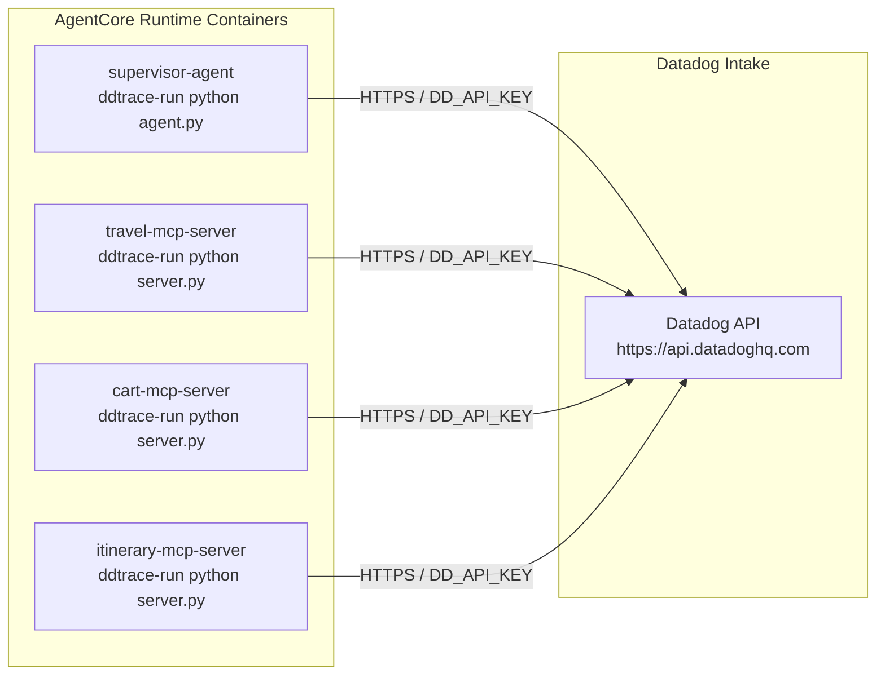

# Architecture — Datadog LLM Observability for AgentCore Travel Concierge Agent

## System Architecture

```mermaid
graph TB
    subgraph User Layer
        User([fa:fa-user User])
        WebUI[Web UI<br/>React + Amplify]
    end

    subgraph AgentCore Runtime
        Supervisor[Supervisor Agent<br/>Strands Agent + ddtrace<br/><i>DD_SERVICE=supervisor-agent</i>]
        TravelSub[travel_assistant<br/>Strands Subagent]
        CartSub[cart_manager<br/>Strands Subagent]
    end

    subgraph AgentCore Gateway
        GW[Gateway<br/>OAuth2 + MCP Routing]
    end

    subgraph MCP Servers — AgentCore Runtime
        TravelMCP[Travel MCP Server<br/>ddtrace<br/><i>DD_SERVICE=travel-mcp-server</i>]
        CartMCP[Cart MCP Server<br/>ddtrace<br/><i>DD_SERVICE=cart-mcp-server</i>]
        ItineraryMCP[Itinerary MCP Server<br/>ddtrace<br/><i>DD_SERVICE=itinerary-mcp-server</i>]
    end

    subgraph AWS Services
        Bedrock[Amazon Bedrock<br/>Claude Sonnet 4.5]
        DDB[(DynamoDB<br/>User Profiles · Carts · Itineraries)]
        Cognito[Amazon Cognito<br/>Auth + OAuth2]
        Memory[AgentCore Memory<br/>Session History]
    end

    subgraph Datadog
        DDAPM[Datadog APM<br/>Distributed Traces]
        DDLLM[Datadog LLM Observability<br/>Prompts · Tokens · Latency]
    end

    User -->|HTTPS| WebUI
    WebUI -->|JWT Auth| Supervisor
    Supervisor --> TravelSub
    Supervisor --> CartSub
    Supervisor -->|Itinerary tools| GW
    TravelSub -->|travel tools| GW
    CartSub -->|cart tools| GW
    GW -->|MCP/HTTP| TravelMCP
    GW -->|MCP/HTTP| CartMCP
    GW -->|MCP/HTTP| ItineraryMCP
    Supervisor -->|InvokeModel| Bedrock
    TravelSub -->|InvokeModel| Bedrock
    CartSub -->|InvokeModel| Bedrock
    TravelMCP --> DDB
    CartMCP --> DDB
    ItineraryMCP --> DDB
    Supervisor --> Memory
    WebUI --> Cognito

    Supervisor -.->|agentless traces| DDAPM
    TravelMCP -.->|agentless traces| DDAPM
    CartMCP -.->|agentless traces| DDAPM
    ItineraryMCP -.->|agentless traces| DDAPM
    DDAPM --> DDLLM

    classDef dd fill:#632CA6,stroke:#632CA6,color:#fff
    classDef aws fill:#FF9900,stroke:#FF9900,color:#fff
    classDef agent fill:#1A73E8,stroke:#1A73E8,color:#fff
    classDef mcp fill:#0D652D,stroke:#0D652D,color:#fff

    class DDAPM,DDLLM dd
    class Bedrock,DDB,Cognito,Memory aws
    class Supervisor,TravelSub,CartSub agent
    class TravelMCP,CartMCP,ItineraryMCP mcp
```

## Distributed Trace Flow

A single user request (e.g., *"Find flights from NYC to Tokyo"*) produces a distributed trace that spans every service in the system:

```mermaid
sequenceDiagram
    participant U as User / Web UI
    participant S as Supervisor Agent
    participant TS as travel_assistant (subagent)
    participant GW as AgentCore Gateway
    participant TMCP as Travel MCP Server
    participant B as Amazon Bedrock
    participant DD as Datadog

    U->>S: "Find flights from NYC to Tokyo"
    activate S
    Note over S: Root span: supervisor-agent

    S->>B: InvokeModel (routing decision)
    B-->>S: → delegate to travel_assistant

    S->>TS: travel_assistant(query)
    activate TS
    Note over TS: Child span: strands.agent.travel_assistant

    TS->>B: InvokeModel (plan tool calls)
    B-->>TS: → call travel_flight_search

    TS->>GW: MCP tool call: travel_flight_search
    GW->>TMCP: HTTP → travel-mcp-server
    activate TMCP
    Note over TMCP: Child span: travel-mcp-server

    TMCP->>TMCP: Execute flight search (SerpAPI)
    TMCP-->>GW: Flight results
    deactivate TMCP

    GW-->>TS: MCP response
    TS->>B: InvokeModel (format results)
    B-->>TS: Formatted flight options

    TS-->>S: Subagent response
    deactivate TS

    S-->>U: "Here are 5 flights from NYC to Tokyo..."
    deactivate S

    S-.>>DD: Trace (agentless)
    TMCP-.>>DD: Trace (agentless)
```

## Trace Hierarchy (Span Tree)

When viewed in Datadog APM, a typical request produces the following span hierarchy:

```
supervisor-agent                                    [root span — full request duration]
├── LLM: bedrock.converse (routing)                 [~1-3s — supervisor decides which subagent]
│   └── input_tokens: ~800, output_tokens: ~50
├── strands.tool: travel_assistant                  [subagent delegation span]
│   ├── LLM: bedrock.converse (plan)                [~1-2s — subagent plans tool calls]
│   │   └── input_tokens: ~1200, output_tokens: ~100
│   ├── MCP tool: travel_flight_search              [tool execution span]
│   │   └── travel-mcp-server                       [cross-service span]
│   │       └── HTTP: SerpAPI call                  [external API call]
│   ├── LLM: bedrock.converse (synthesize)          [~2-4s — format results]
│   │   └── input_tokens: ~3000, output_tokens: ~500
│   └── total_tokens: ~4800
└── total_tokens: ~5650
```

## Datadog Collection — Agentless Mode

All services use **agentless mode** (`DD_LLMOBS_AGENTLESS_ENABLED=1`), meaning traces are sent directly to Datadog's intake API over HTTPS without requiring a Datadog Agent sidecar container.



Each container's Dockerfile sets the required environment variables:

| Variable | Value | Purpose |
|----------|-------|---------|
| `DD_TRACE_ENABLED` | `true` | Enable APM tracing |
| `DD_LLMOBS_ENABLED` | `1` | Enable LLM Observability |
| `DD_LLMOBS_AGENTLESS_ENABLED` | `1` | Send traces directly (no sidecar) |
| `DD_LLMOBS_ML_APP` | `travel-concierge-agent` | Groups all services under one LLM app |
| `DD_SERVICE` | `supervisor-agent` / `travel-mcp-server` / etc. | Per-service name in APM |
| `DD_ENV` | `demo` | Environment tag |
| `DD_API_KEY` | *(from Secrets Manager)* | Datadog API key for authentication |

The `DD_API_KEY` is retrieved at deploy time from AWS Secrets Manager (`datadog/aig-agent/api-key`) and injected into the container environment via the CDK stacks.

## Service Map

In Datadog APM → Service Map, the deployed system renders as:

```
┌─────────────────────┐
│   supervisor-agent   │
│   (Strands Agent)    │
└──────┬──────┬───────┘
       │      │
       │      └──────────────────────────────┐
       │                                     │
       ▼                                     ▼
┌──────────────┐  ┌──────────────┐  ┌────────────────────┐
│ travel-mcp-  │  │  cart-mcp-   │  │  itinerary-mcp-    │
│   server     │  │   server     │  │     server         │
└──────┬───────┘  └──────┬───────┘  └────────┬───────────┘
       │                 │                   │
       ▼                 ▼                   ▼
┌──────────────────────────────────────────────────────────┐
│                    Amazon Bedrock                         │
│                  Claude Sonnet 4.5                        │
└──────────────────────────────────────────────────────────┘
```

All four services share `DD_LLMOBS_ML_APP=travel-concierge-agent`, which groups them together in the Datadog LLM Observability UI for unified monitoring.
